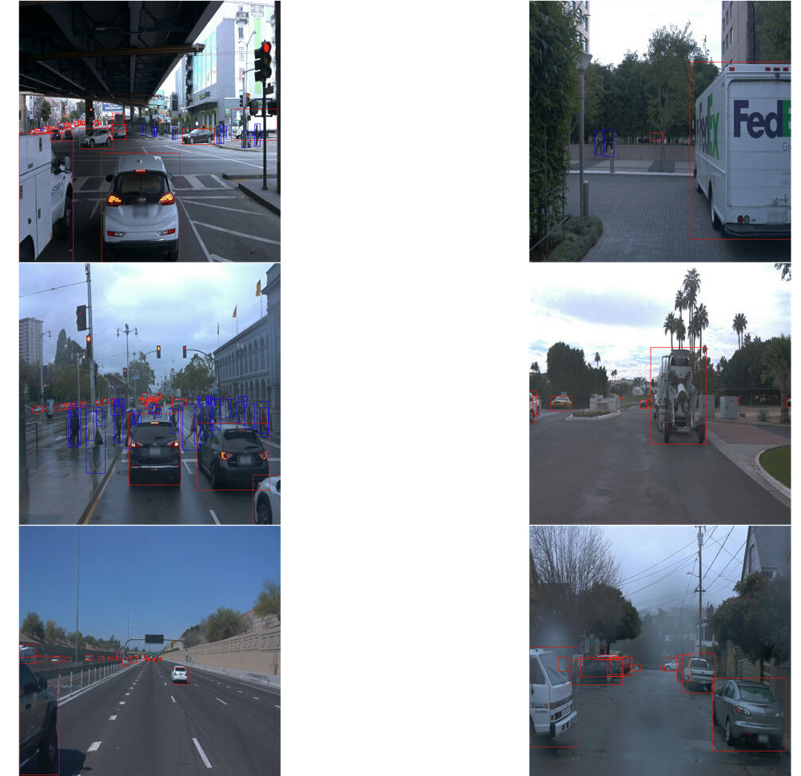
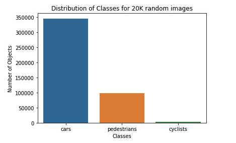
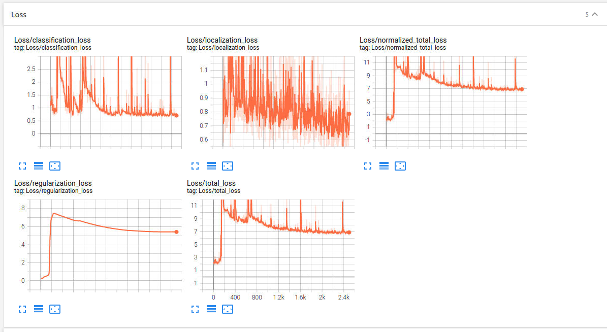
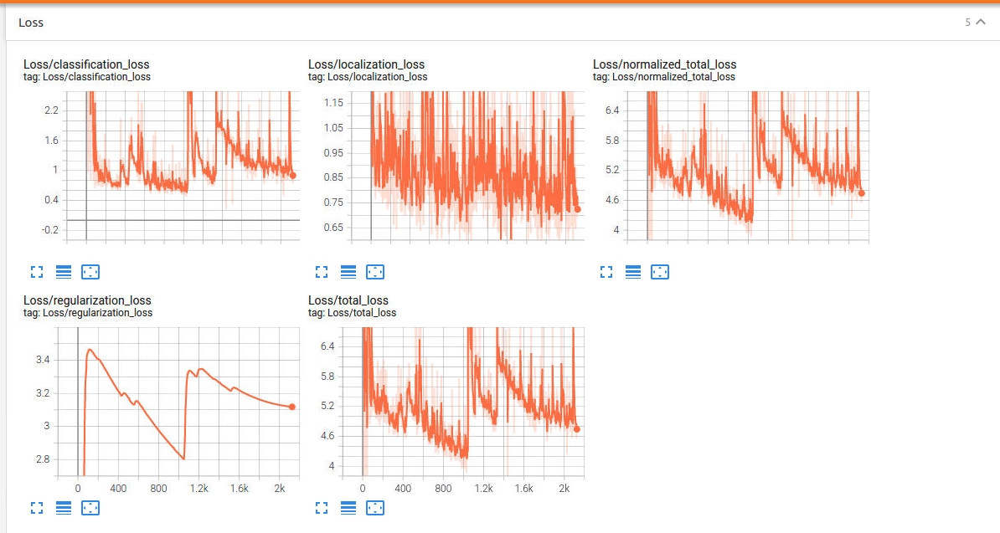
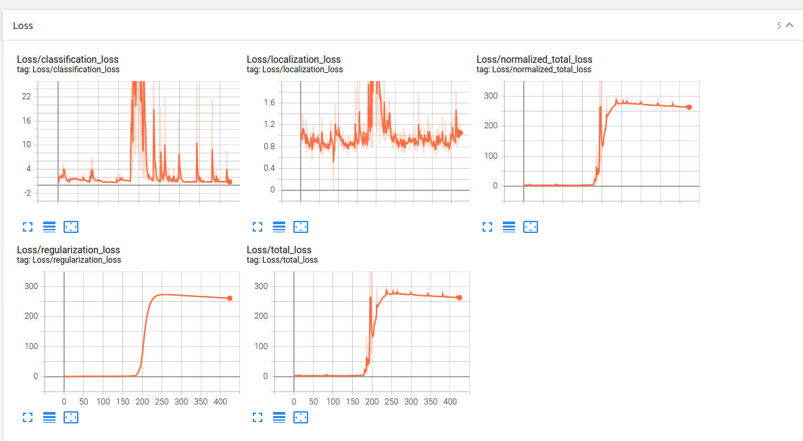
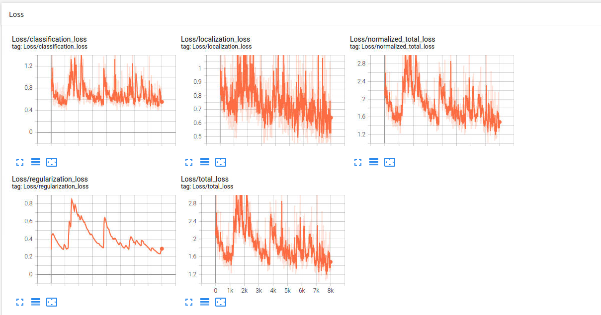

## Submission

### Project overview
The goal of this project is to use a deep learning based object detection model to detect and localize
pedestrians, cyclists and vehicles visible in a camera sensor from a self driving car ego vehicle. Such
a system is an important component of self driving car systems as it informs the control system to
navigate around such obstacles and not bump into them (causing accidents).

### Set up, Training and Improving on the base performance
0. I used the udacity project workspace to complete this project in the GPU instance. The requirements are already installed in
   that workspace but I created a requirements.txt file by running `pip freeze > requirements.txt`. These requirements may be
   installed via the command `pip install -r requirements.txt`.
1. The for training, validation and testing was already set up in the project workspace. If one were running the model in their
	own GPU instance, they could download the data from Google Cloud Bucket at 
	(https://console.cloud.google.com/storage/browser/waymo_open_dataset_v_1_2_0_individual_files/) as described in the project instructions
	and splitting them up into train, test and validation splits by running `create_splits.py`.
2. The exploratory data analysis was done by running the jupyter notebook `Exploratory Data Analysis.ipynb`. Please find the saved state of the
	notebook in the commited project. Similarly, various data augmentations were also experimented with using the notebook
	`Explplore augmentations.ipynb`.
3. The pipeline config file was edited using the following command to set up the pipekline for the SSD model:
	```
		python edit_config.py --train_dir /home/workspace/data/train/ --eval_dir /home/workspace/data/val/ --batch_size 2 --checkpoint /home/workspace/experiments/pretrained_model/ssd_resnet50_v1_fpn_640x640_coco17_tpu-8/checkpoint/ckpt-0 --label_map /home/workspace/experiments/label_map.pbtxt
	```
4. Training was launched using the command: 
	```
	python experiments/model_main_tf2.py --model_dir=experiments/reference/ --pipeline_config_path=experiments/reference/pipeline_new.config
	```
5. Evaluation process was started by running the following command:
	```
	python experiments/model_main_tf2.py --model_dir=experiments/reference/ --pipeline_config_path=experiments/reference/pipeline_new.config --checkpoint_dir=experiments/reference/
	```
6. Training and Evaluation performance can be observed through tensorboard which can be launched using the following command:
	```
	python -m tensorboard.main --logdir experiments/reference/
	```

### Dataset
#### Dataset analysis
I used the repository's `Exploratory Data Analysis.ipynb` notebook to understand the dataset better by first implementing the `display_images` function to show 6 random images at a time using matplotlib. The three types of labels were plotted using different colors as shown in the following figure:


Then I used the seaborn library barplot to plot the distribution of
the three types of labels in a randomly chosen set of 20K images. The results are shown in the following figure:



There are a lot more cars and pedestrians compared to cyclists in the dataset.

#### Cross validation
The validation strategy adopted here is to first train the model on a train set and then evaluate it
on a held out validation set. The best performing model on the validation set was used to generate
the animation on the dataset contained in the test set. Train, validation and test sets contain
non overlapping images but they are assumed to be drawn from the same distribution.

#### Training

I used the already configured SSD based model for this project which contains a resnet 50 v1 based
backbone as the feature extractor. 


##### Reference
With the default pipeline_new.config file, the minimum loss I could get to was between 6 and 7.


A snippet of the log from the reference run follows:

```
I1004 17:54:48.105907 140126150264576 model_lib_v2.py:682] Step 2300 per-step time 0.759s loss=6.708
INFO:tensorflow:Step 2400 per-step time 0.747s loss=6.667
I1004 17:56:04.581851 140126150264576 model_lib_v2.py:682] Step 2400 per-step time 0.747s loss=6.667
INFO:tensorflow:Step 2500 per-step time 0.762s loss=7.055
I1004 17:57:20.851933 140126150264576 model_lib_v2.py:682] Step 2500 per-step time 0.762s loss=7.055
```

#### Improving on the Reference
#####Experiment0: 


Added the random image scale augmentation. With this change the loss comes down in the range of 4 to 5.

```
I1004 18:24:06.289485 139711515727616 model_lib_v2.py:682] Step 1900 per-step time 0.760s loss=4.898
INFO:tensorflow:Step 2000 per-step time 0.761s loss=4.979
I1004 18:25:21.603495 139711515727616 model_lib_v2.py:682] Step 2000 per-step time 0.761s loss=4.979
INFO:tensorflow:Step 2100 per-step time 0.761s loss=5.636
I1004 18:26:38.783661 139711515727616 model_lib_v2.py:682] Step 2100 per-step time 0.761s loss=5.636
INFO:tensorflow:Step 2200 per-step time 0.751s loss=4.757
I1004 18:27:54.655024 139711515727616 model_lib_v2.py:682] Step 2200 per-step time 0.751s loss=4.757
```

##### Experiment1:

Added random adjust brightness, contrast and hue and random distor color to setting from experiment 0. With this change the loss further decreases to the range of 3-4 in the first 100 steps. however it blows up after that.


```
I1004 18:31:51.066531 140570807564032 model_lib_v2.py:682] Step 100 per-step time 0.761s loss=3.605
INFO:tensorflow:Step 200 per-step time 0.731s loss=125.497
I1004 18:33:06.010513 140570807564032 model_lib_v2.py:682] Step 200 per-step time 0.731s loss=125.497
INFO:tensorflow:Step 300 per-step time 0.729s loss=288.689
I1004 18:34:21.137516 140570807564032 model_lib_v2.py:682] Step 300 per-step time 0.729s loss=288.689
INFO:tensorflow:Step 400 per-step time 0.770s loss=264.800
I1004 18:35:36.138855 140570807564032 model_lib_v2.py:682] Step 400 per-step time 0.770s loss=264.800
```

##### Experiment2:
In this experiment I changed the optimizer to use adam optimizer
with no learning rate schedule (on top of the changes from experiment 1) with an exponentially decaying learning rate with decay steps of 500 and initial learning rate of 0.001. That did not give great results so I revisited the augmentations and ended up choosing the following augmentations: random adjust brightness, horizontal flip, crop image and rgb to gray. Also increased the number of training steps to 25000. That brought the loss down between 2 and 3 and in the first few hundred steps so I continued training as the loss continues to go down.



```
I1004 19:23:47.248156 139892938168064 model_lib_v2.py:682] Step 1500 per-step time 0.764s loss=1.515
INFO:tensorflow:Step 1600 per-step time 0.739s loss=1.393
I1004 19:25:05.015934 139892938168064 model_lib_v2.py:682] Step 1600 per-step time 0.739s loss=1.393
INFO:tensorflow:Step 1700 per-step time 0.761s loss=1.399
I1004 19:26:21.220833 139892938168064 model_lib_v2.py:682] Step 1700 per-step time 0.761s loss=1.399
INFO:tensorflow:Step 1800 per-step time 0.771s loss=1.556
I1004 19:27:37.478454 139892938168064 model_lib_v2.py:682] Step 1800 per-step time 0.771s loss=1.556
INFO:tensorflow:Step 1900 per-step time 0.795s loss=1.440
I1004 19:28:54.050045 139892938168064 model_lib_v2.py:682] Step 1900 per-step time 0.795s loss=1.440
INFO:tensorflow:Step 2000 per-step time 0.779s loss=1.715
I1004 19:30:10.181799 139892938168064 model_lib_v2.py:682] Step 2000 per-step time 0.779s loss=1.715
```

